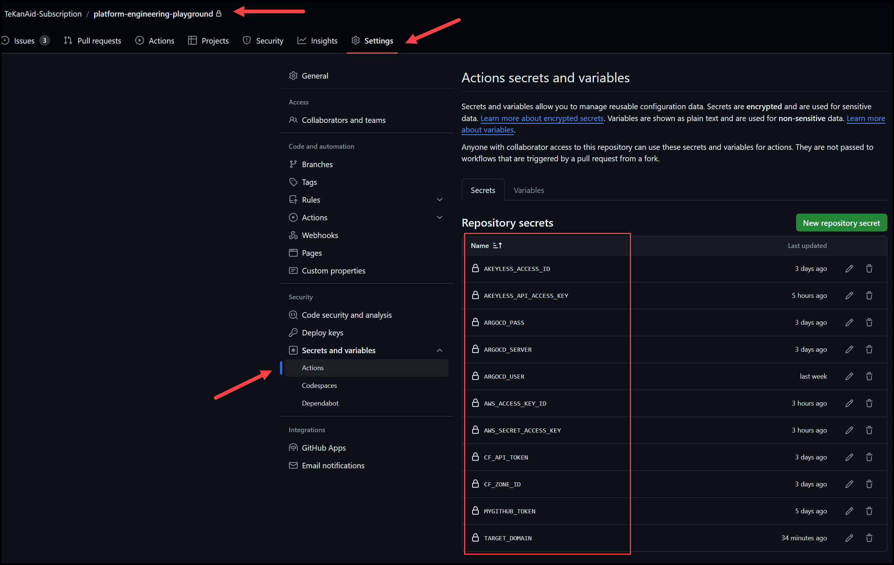
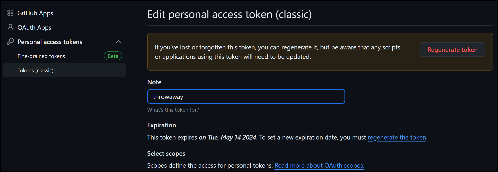
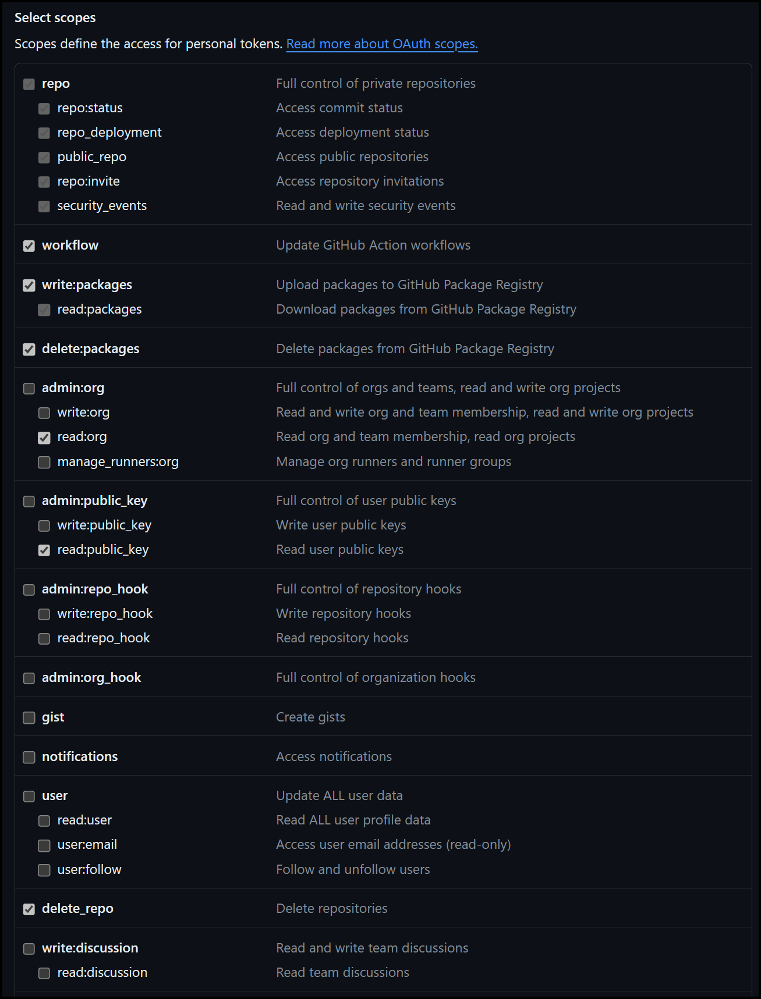
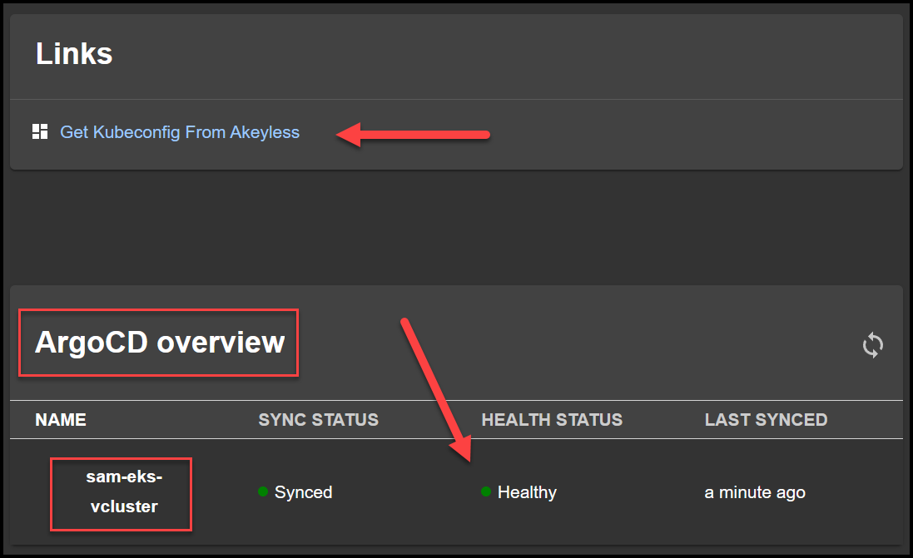

# Overview

A Playground For Platform Engineering Tools

- ArgoCD
- Crossplane
- Backstage
- AWS
- GitHub Actions
- vClusters

You can run this playground in your own environment or request a K8s cluster from the Platform Engineering Playground on TeKanAid Academy. Either way, make sure to fork this repo to have full control over it. You will need this for ArgoCD among other things.

Once you have a running K8s cluster you can proceed to install the script below.

Run the `install_script.sh` to install ArgoCD and Crossplane. It will also get Backstage ready. You'll need to create a few more configurations before running Backstage.

## ArgoCD

### Access ArgoCD

#### Login to the UI
To access ArgoCD, you will need the initial admin password. You can get it using the command below:

```bash
kubectl get secret -n argocd argocd-initial-admin-secret -o json | jq -r '.data.password' | base64 --decode
```

And then use the username admin with this password to log in to ArgoCD.

You can port forward the service like this:

```bash
kubectl port-forward -n argocd service/argocd-server 8080:443
```

#### Login to the CLI

```bash
argocd login 127.0.0.1:8080 --username admin --password $(kubectl get secret -n argocd argocd-initial-admin-secret -o json | jq -r '.data.password' | base64 --decode) --grpc-web --insecure
```

#### Use ngrok for GitHub to connect to ArgoCD

When Backstage creates a new GitHub repo, we need to get GitHub actions to create an ArgoCD app that monitors this new GitHub repo. We need to expose our local ArgoCD instance to the internet so that GitHub can connect to it. We will use ngrok for this. In production, you would use an ingress in your cluster with a domain name and DNS configured.

First, [sign up](https://dashboard.ngrok.com/signup) for a free ngrok account and get an authtoken

1. Add authtoken
```bash
ngrok config add-authtoken <token>
```

2. Start a tunnel
```bash
ngrok http https://localhost:8080
```

You'll get something like this:
```bash
Forwarding                    https://a7eb-24-150-170-114.ngrok-free.app -> https://localhost:8080
```

The `https://a7eb-24-150-170-114.ngrok-free.app` address is your ngrok forwarding address. You can use this to connect to your local ArgoCD instance from GitHub. Traffic will get forward to your local ArgoCD server running on `localhost:8080`.

### Get an ArgoCD Token for Backstage Plugin

To allow Backstage to interact with ArgoCD, you'll need to generate an ArgoCD API token. You can do this by running the following command:

#### Allow admin account to create API tokens

First wee need to allow the admin account to create API tokens. We can do this by editing the `argocd-cm` ConfigMap and adding the following:

```bash
kubectl patch -n argocd configmap argocd-cm --type merge -p '{"data":{"accounts.admin":"apiKey"}}'
```

#### Generate the Token

Now you can generate an API token by running the command:
```bash
argocd account generate-token
```

or directly from the UI under `settings > accounts`

Now take this token and put in the Backstage `secrets.sh` file that you will create later in the Backstage section. It will look something like this:

```bash
export ARGOCD_AUTH_TOKEN=
```

## Update GitHub Actions Workflow

In the `.github/workflows/deploy_with_argocd.yaml` workflow file we do the following: 

1. Install the Argo CD CLI
2. Login to the Argo CD server using credentials from GitHub secrets
3. Add the repository that will be monitored by Argo CD
4. Use the Argo CD CLI to create a new application for the cluster, pointing to the repository path that contains the cluster manifests. This will make Argo CD deploy and sync the cluster.

So in summary, it enables GitOps workflow for provisioning and managing Kubernetes clusters using Argo CD, triggered by GitHub Actions.

Notice that you will need to fill in 4 secrets in the GitHub Actions Secrets section as shown in the image below:



These are the secrets:
AKEYLESS_ACCESS_ID and AKEYLESS_API_ACCESS_KEY -> Credentials to access Akeyless to eventually drop the vCluster Kubeconfig in a static secret there.
ARGOCD_PASS -> the password you got from (kubectl get secret -n argocd argocd-initial-admin-secret -o json | jq -r '.data.password' | base64 --decode)
ARGOCD_SERVER -> f1c6-24-150-170-114.ngrok-free.app (the ngrok server not URL, don't include https://)
ARGOCD_USER -> admin
AWS_ACCESS_KEY_ID and AWS_SECRET_ACCESS_KEY -> AWS credentials to access the EKS cluster and generate vClusters
CF_API_TOKEN and CF_ZONE_ID -> Credentials and Zone ID to access Cloudflare and create DNS records for the vClusters
MYGITHUB_TOKEN -> you will need to create a Classic GitHub token from developer settings as shown in the next two images, or use the same one you have for Backstage in the `backstage/my-backstage-app/secrets.sh` file.
TARGET_DOMAIN -> this is the hostname of the LoadBalancer that Traefik's ingressRouteTCP creates to access the vClusters. (You will fill this out later after you create the EKS cluster.)




## Crossplane Secrets for Clouds

Most of the crossplane configuration in this repo were taken from Viktor Farcic, so shout out to him. Here is his original repo: https://github.com/vfarcic/crossplane-kubernetes

### Step 1: Prepare Your AWS Credentials

Make sure you're in the `crossplane` folder.

You'll need your AWS Access Key ID and Secret Access Key. If you're using TeKanAid Premium, you can get these from the lesson on setting up AWS.

These should be formatted as follows in a file called `aws_credentials.conf` I have an example file for you called `aws_credentials-example.conf`:

```ini
[default]
aws_access_key_id = YOUR_ACCESS_KEY_ID
aws_secret_access_key = YOUR_SECRET_ACCESS_KEY
```

Replace `YOUR_ACCESS_KEY_ID` and `YOUR_SECRET_ACCESS_KEY` with your actual AWS credentials and rename the file to `aws_credentials.conf`. If you are a TeKanAid Premium subscriber, you can get these credentials from the TeKanAid lesson for setting up AWS.

### Step 2: Create the Secret in Kubernetes

You can create the Kubernetes secret from the `credentials.conf` file using `kubectl`. 

Run the following command:

```sh
kubectl create secret generic aws-creds --from-file=creds=/workspaces/platform-engineering-playground/crossplane/aws_credentials.conf -n crossplane-system
```

This command does the following:
- `create secret generic aws-creds` tells Kubernetes to create a new generic secret named `aws-creds`.
- `--from-file=creds=./credentials.conf` adds the content of your `credentials.conf` file to the secret under the key `creds`.
- `-n crossplane-system` specifies the namespace `crossplane-system` for the secret.

### Step 3: Verify the Secret

After creating the secret, you can verify it's correctly created in the `crossplane-system` namespace by running:

```sh
kubectl get secret aws-creds -n crossplane-system -o yaml
```

This command shows the details of the `aws-creds` secret. For security reasons, the actual credentials content will be base64 encoded.


## Create EKS Cluster with Crossplane

You could create an EKS cluster directly as shown below or use backstage template to to do that which will use ArgoCD. The backstage template is explained later on.

```bash
kubectl create namespace infra
kubectl --namespace infra apply --filename ./crossplane/eks_claim.yaml
kubectl --namespace infra get clusterclaims
kubectl get managed
```

### Access the Cluster

```bash
kubectl get secret a-team-eks-cluster -o jsonpath='{.data.kubeconfig}' | base64 -d > a-team-eks-kubeconfig.yaml
export KUBECONFIG=$(pwd)/a-team-eks-kubeconfig.yaml
kubectl get nodes
kubectl get namespaces
```

## Delete the EKS Cluster with Crossplane

```bash
kubectl --namespace infra delete \
    --filename ./crossplane/eks_claim.yaml

kubectl get managed

# Wait until all the resources are deleted (ignore `object` and
#   `release` resources)
```

## Backstage

### Backstage Installation

To install Backstage first make sure you're in the `backstage` folder then do the following:

1. Rename `secrets-example.sh` to `secrets.sh` file in the `backstage/my-backstage-app` folder and add the environment variables you want. This file won't be checked into git. The `GITHUB_TOKEN` can be the same one you created earlier.
2. Run the script `create_k8s_secrets_for_backstage.sh` which will create a file called: `my-backstage-secrets.yaml` like this:
```bash
/workspaces/platform-engineering-playground/backstage/my-backstage-app/create_k8s_secrets_for_backstage.sh
```
3. Create this secret with:
```bash
kubectl apply -f /workspaces/platform-engineering-playground/backstage/my-backstage-app/my-backstage-secrets.yaml
```
4. If you want to access GCP, put your google creds json file here: `backstage/my-backstage-app/packages/backend/google-creds.json` then create a secret like this:
```bash
kubectl create secret generic google-creds \
  --from-file=google-creds.json=/workspaces/platform-engineering-playground/backstage/my-backstage-app/packages/backend/google-creds.json \
  --namespace backstage
```
in the `backstage/my-backstage-app/values.yaml` file uncomment the following lines:
```yaml
  extraVolumeMounts:
    # - name: google-creds-volume
    #   mountPath: "/etc/secrets"
    #   readOnly: true

  extraVolumes:
    # - name: google-creds-volume
    #   secret:
    #     secretName: google-creds
```
5. Finally run the `helm` command to install Backstage:
```bash
helm upgrade --install backstage backstage/backstage --namespace backstage -f /workspaces/platform-engineering-playground/backstage/my-backstage-app/values.yaml --set backstage.image.tag=v1.0.5
```

Wait until both the backstage and postgresql pods are running:

```bash
watch kubectl get po -n backstage
```

### Backstage Access

To access Backstage, you can port-forward the service like this below (Make sure the pod is running for a minute or so first):
```bash
kubectl port-forward -n backstage service/backstage 7007:7007
```

You will already have some built-in templates that were created with the backstage app that you can explore in the UI and also take a look at the template files in the `backstage/my-backstage-app/packages/backend/templates` directory.

But let's register a new one directly from the UI.

Click the `Create` button in the left naviation pane and then click the button called: `REGISTER EXISTING COMPONENT`

Enter the URL below where our EKS-Cluster-Crossplane template exists:
```
https://github.com/TeKanAid-Subscription/platform-engineering-playground/blob/main/backstage/my-backstage-app/packages/backend/templates/eks-cluster-crossplane/template.yaml
```

Then once you've registered this template, you can now access it by clicking the `Create` button on the left navigation pane and selecting that template.

You can now create an EKS cluster with crossplane using Backstage. Here is the workflow:

Backstage -> GitHub Actions -> ArgoCD -> Crossplane -> you will end up with a secret in the newly created namespace in your cluster with the kubeconfig for the EKS cluster. 

You can check the progress of the EKS cluster creation by running the following commands:
```bash
kubens <your-cluster-name>
kubectl get managed
```

The name of the cluster you chose when filling out the Backstage template will be the name of the secret, e.g. `a-team-eks-cluster`. You can then use the following commands to access the new EKS cluster:

```bash
kubectl get secret a-team-eks-cluster -o jsonpath='{.data.kubeconfig}' | base64 -d > a-team-eks-kubeconfig.yaml
export KUBECONFIG=$(pwd)/a-team-eks-kubeconfig.yaml
kubectl get nodes
kubectl get namespaces
```

#### Register the New Cluster in ArgoCD

Now you can register the new cluster in ArgoCD like this:

```bash
argocd cluster add your-cluster-context --name your-cluster-for-argocd
```

Example:

```bash
argocd cluster add my-new-eks-cluster --name eks-dev
```

## Create vClusters for Devs on our EKS Cluster

### Add the Target Domain

As platform engineers, we need to add the Target Domain to GitHub Actions secrets. The Target Domain is the hostname of the LoadBalancer that Traefik's ingressRouteTCP creates to access the vClusters. 

To get the value, run the following command:

```bash
kubectl get svc traefik -n traefik -o=jsonpath='{.status.loadBalancer.ingress[0].hostname}'
```

Now add this value to the `TARGET_DOMAIN` GitHub Actions secret.

### Register a New vCluster Template in Backstage

Let's register a new template for creating a vCluster in Backstage.

Click the `Create` button in the left naviation pane and then click the button called: `REGISTER EXISTING COMPONENT`

Enter the URL below where our EKS-Cluster-Crossplane template exists:
```
https://github.com/TeKanAid-Subscription/platform-engineering-playground/blob/main/backstage/my-backstage-app/packages/backend/templates/vcluster/template.yaml
```

Then once you've registered this template, you can now access it by clicking the `Create` button on the left navigation pane and selecting that template.

You can now create a vCluster using Backstage, just follow the template steps and input values in the forms.

### Access the New vCluster

Wait until the vCluster component dashboard in Backstage shows the new vCluster as ready. 



Then, you can access the vCluster in Akeyless by getting the kubeconfig from the `Kubeconfig` static secret.

Get the Akeyless static secret at `/vclusters/Kubeconfig`. This is the base64 encoding of the kubeconfig file. Run the commands below to decode and use the kubeconfig:

```bash
ENCODED_KUBECONFIG=YXBpVmVyc2lvbjogdjEKY2x1c3RlcnM6Ci0gY2x1c3RlcjoKICAgIGNlcnRpZmljYXRlLWF1dGhvcml0eS1kYXRhOiBMUzB0TFMxQ1JVZEpUaUJEUlZKVVNVWkpRMEZVUlMwdExTMHRDazFKU1VKa2VrTkRRVkl5WjBGM1NVSkJaMGxDUVVSQlMwSm5aM0ZvYTJwUFVGRlJSRUZxUVdwTlUwVjNTSGRaUkZaUlVVUkVRbWh5VFROTmRHTXlWbmtLWkcxV2VVeFhUbWhSUkVVelRWUk5lVTFVU1hwUFJFVjNTR2hqVGsxcVVYZE9SRVV4VFdwQmVFOVVVWGhYYUdOT1RYcFJkMDVFUlhwTmFrRjRUMVJSZUFwWGFrRnFUVk5GZDBoM1dVUldVVkZFUkVKb2NrMHpUWFJqTWxaNVpHMVdlVXhYVG1oUlJFVXpUVlJOZVUxVVNYcFBSRVYzVjFSQlZFSm5ZM0ZvYTJwUENsQlJTVUpDWjJkeGFHdHFUMUJSVFVKQ2QwNURRVUZSUW1nd05VMVlTSE5PYm1salpUZzViVFZRWnk5MU4wTXJSMDQyYnpOcmNtVnhiRGQ2V1ZSRlQxY0tVbGh6Vm1wcVVGUmpRVzVTU2tGMGN6Sk5helZQY0VsR1YxQk9hbGwzUW1WMVlURTRURkl4VkV0WGFVVnZNRWwzVVVSQlQwSm5UbFpJVVRoQ1FXWTRSUXBDUVUxRFFYRlJkMFIzV1VSV1VqQlVRVkZJTDBKQlZYZEJkMFZDTDNwQlpFSm5UbFpJVVRSRlJtZFJWVFpUU1ZSbmJrSmtURFZDTm05ME5YY3daMnQ0Q2xCMmVGSlBjVEIzUTJkWlNVdHZXa2w2YWpCRlFYZEpSRk5CUVhkU1VVbG5WVVJYYTNWMFNWQlBWMk54TTNSbVdXazBNVGt4TDFoSmFYRk9RV2gyWm1zS1NWRXJSUzlRV1VoNFVuTkRTVkZETjNodWRrSklZalYzVkdjeldFZFFkelU1VkM5RVRIRndTelJtVjJWaWFWYzFPREZrWjFaRWJHMTBkejA5Q2kwdExTMHRSVTVFSUVORlVsUkpSa2xEUVZSRkxTMHRMUzBLCiAgICBzZXJ2ZXI6IGh0dHBzOi8vc2FtLWVrcy12Y2x1c3Rlci50ZWthbmFpZC5jb20KICBuYW1lOiBteS12Y2x1c3Rlcgpjb250ZXh0czoKLSBjb250ZXh0OgogICAgY2x1c3RlcjogbXktdmNsdXN0ZXIKICAgIHVzZXI6IG15LXZjbHVzdGVyCiAgbmFtZTogbXktdmNsdXN0ZXIKY3VycmVudC1jb250ZXh0OiBteS12Y2x1c3RlcgpraW5kOiBDb25maWcKcHJlZmVyZW5jZXM6IHt9CnVzZXJzOgotIG5hbWU6IG15LXZjbHVzdGVyCiAgdXNlcjoKICAgIGNsaWVudC1jZXJ0aWZpY2F0ZS1kYXRhOiBMUzB0TFMxQ1JVZEpUaUJEUlZKVVNVWkpRMEZVUlMwdExTMHRDazFKU1VKclJFTkRRVlJsWjBGM1NVSkJaMGxKVUdsWU5VOVpTSGx2VERSM1EyZFpTVXR2V2tsNmFqQkZRWGRKZDBsNlJXaE5RamhIUVRGVlJVRjNkMWtLWVhwT2VreFhUbk5oVjFaMVpFTXhhbGxWUVhoT2VrVjZUV3BGZVUxNlozaE5RalJZUkZSSk1FMUVVWGhPVkVsM1RWUnJNRTFXYjFoRVZFa3hUVVJSZUFwT1ZFbDNUVlJyTUUxV2IzZE5SRVZZVFVKVlIwRXhWVVZEYUUxUFl6TnNlbVJIVm5SUGJURm9Zek5TYkdOdVRYaEdWRUZVUW1kT1ZrSkJUVlJFU0U0MUNtTXpVbXhpVkhCb1drY3hjR0pxUWxwTlFrMUhRbmx4UjFOTk5EbEJaMFZIUTBOeFIxTk5ORGxCZDBWSVFUQkpRVUpLUWk5V2MyMUJPVmRHTlV0U1VrMEtZMkpHVGtGWU9ETnNiMXBQYXpaU1JXSkdMMGxqVXpWVmRIbEJMM00xU2pRMlUzTjRlRFpPWTBack9VVTJUMUE1U1M4MldFWkNlSFJqYXk5M1JtbERlQXBOT0ZOTloyRXlhbE5FUWtkTlFUUkhRVEZWWkVSM1JVSXZkMUZGUVhkSlJtOUVRVlJDWjA1V1NGTlZSVVJFUVV0Q1oyZHlRbWRGUmtKUlkwUkJha0ZtQ2tKblRsWklVMDFGUjBSQlYyZENVVWRGSzA5T09HUjJia2RYVldOYVprVk5NVUp1YW14NWNtUlpSRUZMUW1kbmNXaHJhazlRVVZGRVFXZE9TRUZFUWtVS1FXbEJXalpDTTJ0R2J6SldXVWRWU1c5SU9DODRibEpWVWpCSVVHcDVaVWhJZEhacWNqQnhNVk5FVjIwNWQwbG5TMEZVZG1KNWIzRXdiR1kxWVVSMGJBcDNhRXN6VDFONVFVMXFOMFpSTlVOVE9YRmlZbEJXWW5oallVazlDaTB0TFMwdFJVNUVJRU5GVWxSSlJrbERRVlJGTFMwdExTMEtMUzB0TFMxQ1JVZEpUaUJEUlZKVVNVWkpRMEZVUlMwdExTMHRDazFKU1VKbFJFTkRRVkl5WjBGM1NVSkJaMGxDUVVSQlMwSm5aM0ZvYTJwUFVGRlJSRUZxUVdwTlUwVjNTSGRaUkZaUlVVUkVRbWh5VFROTmRGa3llSEFLV2xjMU1FeFhUbWhSUkVVelRWUk5lVTFVU1hwUFJFVjNTR2hqVGsxcVVYZE9SRVV4VFdwQmVFOVVVWGhYYUdOT1RYcFJkMDVFUlhwTmFrRjRUMVJSZUFwWGFrRnFUVk5GZDBoM1dVUldVVkZFUkVKb2NrMHpUWFJaTW5od1dsYzFNRXhYVG1oUlJFVXpUVlJOZVUxVVNYcFBSRVYzVjFSQlZFSm5ZM0ZvYTJwUENsQlJTVUpDWjJkeGFHdHFUMUJSVFVKQ2QwNURRVUZVYm5wMFJUZGplV1YyVkRFMFJVYzJSbVJyU0RaVFpuWmxWRWRrTVdGQ2FtWjJjVzE1ZVVsSGVFa0tkVTl3ZEdZclREZGFiblJ5VkhnMVdHSTNZazl0TUVkT1IyVkVTa3RoTVc5MU5XeFBWM2hEYkVGaE1XeHZNRWwzVVVSQlQwSm5UbFpJVVRoQ1FXWTRSUXBDUVUxRFFYRlJkMFIzV1VSV1VqQlVRVkZJTDBKQlZYZEJkMFZDTDNwQlpFSm5UbFpJVVRSRlJtZFJWVUpvVUdwcVpraGlOWGhzYkVoSFdIaEVUbEZhQ2pRMVkzRXpWMEYzUTJkWlNVdHZXa2w2YWpCRlFYZEpSRk5SUVhkU1owbG9RVXBSYlVkblVreEtVbEJyV0dJNVNXZDVWMU5DT1VWUVl6bE5WblJ2UXpVS2JIUlZaMDVCY1VnelUxaGxRV2xGUVhVd2FtMTFWVkl4ZWpseGFGTnFiVTh3TldOa05WQXpRWFpRVXpKRFQxUlZMelJaTmxkblUyUjNNVlU5Q2kwdExTMHRSVTVFSUVORlVsUkpSa2xEUVZSRkxTMHRMUzBLCiAgICBjbGllbnQta2V5LWRhdGE6IExTMHRMUzFDUlVkSlRpQkZReUJRVWtsV1FWUkZJRXRGV1MwdExTMHRDazFJWTBOQlVVVkZTVUp4WW5sTGJHOUZXREZuVGtONFVscFZOekpRY3pWV1oyNUZjMmRJVURWTk5XTnFjVWxaUTI5VlRFeHZRVzlIUTBOeFIxTk5ORGtLUVhkRlNHOVZVVVJSWjBGRmEwZzVWM2xaUkRGWldHdHdSa1Y0ZUhOVk1FSm1lbVZYYUdzMlZIQkZVbk5ZT0doNFRHeFRNMGxFSzNwcmJtcHdTM3BJU0Fwdk1YZFhWREJVYnpRdk1Hb3ZjR05WU0VjeGVWUXZRVmRKVEVWNmVFbDVRbkpSUFQwS0xTMHRMUzFGVGtRZ1JVTWdVRkpKVmtGVVJTQkxSVmt0TFMwdExRbz0K
echo $ENCODED_KUBECONFIG | base64 --decode > vcluster_kubeconfig.yaml
export KUBECONFIG=vcluster_kubeconfig.yaml
kubectl get ns
kubectl get nodes
```

#### Congrats on building an Internal Developer Platform!
